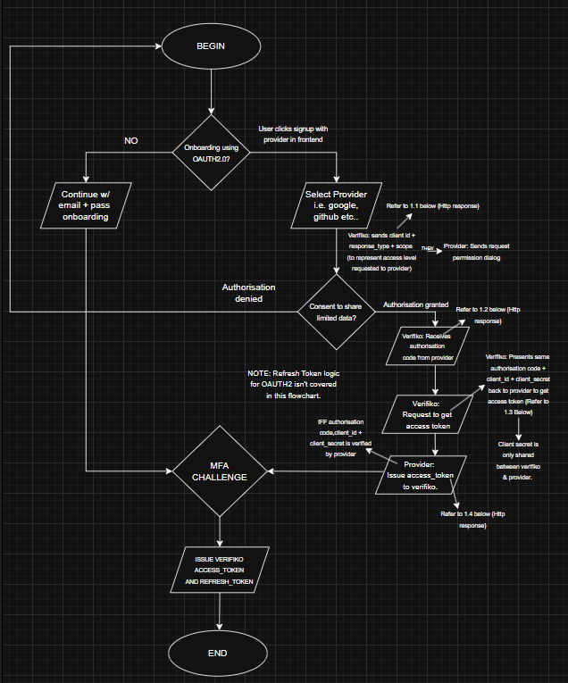
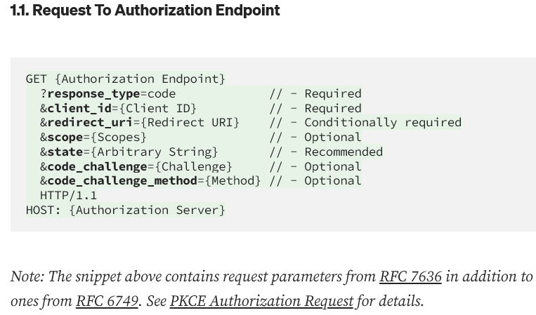
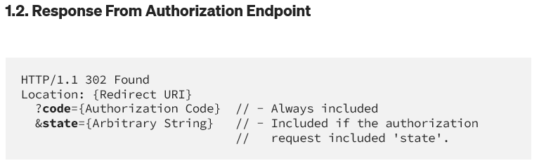
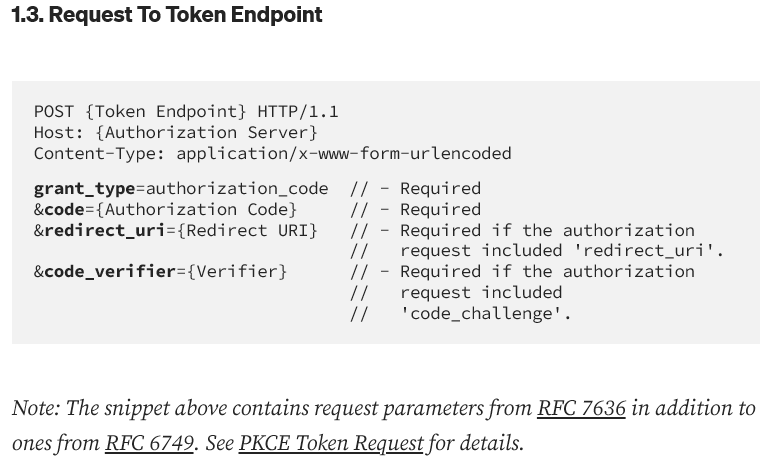
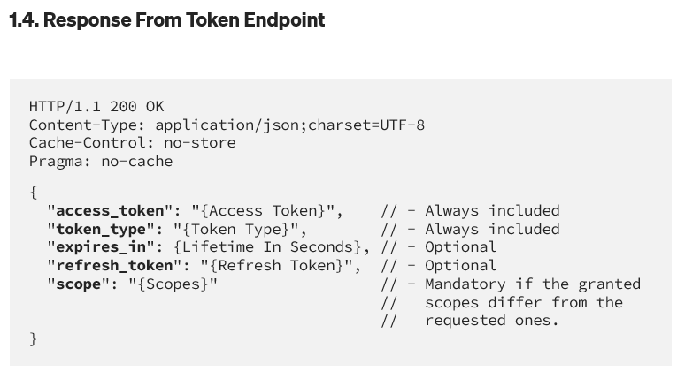

# 
OAUTH Implementation

### References:

- https://www.youtube.com/watch?v=ZV5yTm4pT8g _(i)_
- https://darutk.medium.com/diagrams-and-movies-of-all-the-oauth-2-0-flows-194f3c3ade85 _(ii)_
- https://www.authlete.com/developers/pkce/#2-pkce-authorization-request (Yet to read, important, go over this) _(iii)_
- https://www.geeksforgeeks.org/advance-java/implementing-oauth2-with-spring-security-a-step-by-step-guide/ _(iv)_
- https://medium.com/@yasiffkhan/implementing-oauth2-with-spring-boot-46a3ecf87911 _(v)_
- https://auth0.com/blog/refresh-tokens-what-are-they-and-when-to-use-them *(vi)*
- https://developer.salesforce.com/docs/platform/mobile-sdk/guide/oauth-refresh-token-flow.html *(vii)*

---

## Purpose:

#### _Make onboarding very easy_. 

From previous projects, I've realised people are not willing to sign up for something
unless it's something they actively use. Now this could be due to two potential factors; either they are just not
bothered sitting through entering their email and filling 2 fields with their password + other fields, or they
are simply reluctant for security reasons. Implementing the easiest onboarding process, doesn't guarantee retention,
it simply increases the likelihood of it. Nonetheless, it's a critical aspect to include in modern day sites and apps
as it has a massive potential to generate more signups and improves overall security by going passwordless etc..

### What is OAUTH2?

_"OAuth2 (Open Authorization 2.0) is a framework that allows applications to access user data hosted on external services without requiring users to share their passwords. Instead, users authorize access via tokens issued by the service provider."_  
(As defined by geeksforgeeks author: https://www.geeksforgeeks.org/advance-java/implementing-oauth2-with-spring-security-a-step-by-step-guide/)

### How does OAUTH2 work?

OAUTH2.0 works by letting an application access parts of your account on another service through secure tokens instead of your password.   
After consent of user, Verifiko will just gain limited access to the user data including the email which is required for sending codes and is needed for a full account and first/last name to help generate a unqiue username for those that login with OATUH2.0, note that this username is able to be changed later. That's about it, we don't really need access to other peices of data, we must respect all individuals privacy.

### Onboarding process (OAUTH2.0 + MFA):

- OAuth callback
    - OAuth2AuthenticationSuccessHandler
        - OAuthUserFactory (normalize provider data → your User)
        - account linking check
        - create/fetch your User entity
        - trigger MFA challenge (don't issue tokens yet)
        - MFA verified
        - issue YOUR access + refresh tokens

### HTTP Requests/Responses:

- Note these are simply from _Reference ii_ and serve as examples. They may change for my implmentation. May change considering article is from 2017. 

 

 

## Refresh Tokens

### What is a Refresh Token?
 *"For security purposes, access tokens may be valid for a short amount of time. Once they expire, client applications can use a refresh token to "refresh" the access token. That is, a refresh token is a credential artifact that lets a client application get new access tokens without having to ask the user to log in again."* — (Dan Arias, Sam Bellen, Oct 7 2021, *Reference vi*)
  
  This means that as long as the current refresh token is valid and not expried, the provider will be able to provide user with another access_token.
  But note there is a big risk here if our refresh token lifespan is very long and authenticity security principles are breached i.e. malicious hacker logs in to your account and now since new access tokens are being constantly generated every x minutes the malicious hacker could have extended period of access to your account. **{Research mechanisms to prevent against this}** *Maybe look into refresh token flow for auth endpoint and how rotation + possiblility of re-use is handled*.

### The overall flow of Refresh Tokens:
The refresh token flow involves the following steps:

  - Verifiko uses the existing refresh token to request a new access token.
  - After verifying the request, provider grants a new access token to the client.

### Handling Refresh Token reuse/rotation;

---

## Considerations:

- Generally passwords aren't changeable if logged in with social login, e.g github or google.
  In practice, it may be doable, we could let user change password so that they are able to
  sign in with both the social login + the registered email and password aswell.
  However, assuming somebody (actually most singups will probably be using oauth) sings in with
  google for example, they will most likely never even contemplate fiddling around with a password. This is a quite
  a chunk of complexity and thinking we will have to handle for a possibility that has a very low chance
  of occuring. No stats to back this, just a reasonable inference. In other words, the ROI isn't very appealing here.
  I will infact hold my horses on this one. Changing passwords logic is mainly reserved for those with email + pass
  signups.

- What if somebody signs in with github using an email e.g johndoe@gmail.com and then tries to signup with google
  which is using the same johndoe@gmail.com. In the case this happens, we should detect the duplicate email and then
  automatically link to google provider instead of letting two accounts be created.
